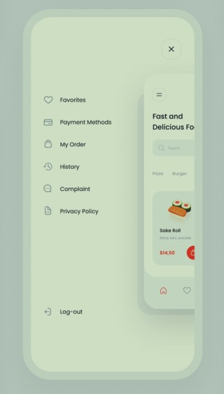
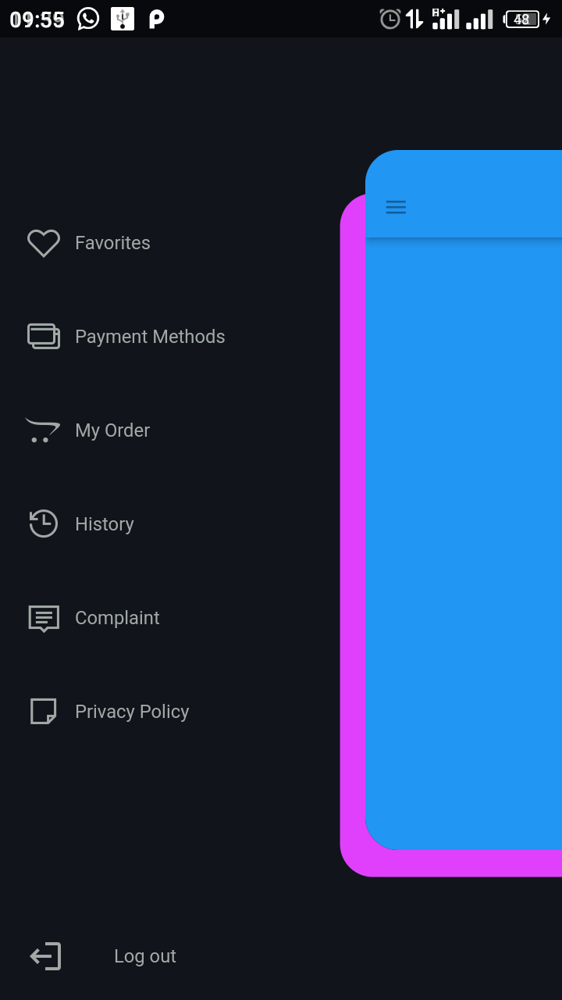

# Scaled Animated Scaffold

[](https://pub.dartlang.org/packages/scaled_animated_scaffold)

A customized Scaffold widget that animates and scales down its content revealing a fully-customizable menu while keeping other functionality developers are used to intact.


## Usage

#### With added body layer
### [Inspiration (behance)](https://www.behance.net/gallery/107238071/Food-Delivery-App-UI-Kit)


### using the library



### Example
```dart
@override
Widget build(BuildContext context) {
  return ScaledAnimatedScaffold(
    // Add your layerColor of choice
    layerColor: Theme.of(context).primaryColor.withOpacity(0.7),
    // optional parameters to alter layer constraints
    layerTopOffset: 30,
    layerRightOffset: 0.3,
    layerBottomOffset: -15,
    menuConfiguration: ScaledAnimatedScaffoldMenuConfiguration(
      header: ScaledAnimatedScaffoldMenuButton(
        icon: Icon(
          Icons.account_circle,
        ),
        label: Text('John Wilkins'),
        onPressed: () {},
      ),
      content: Column(
        children: [
          ScaledAnimatedScaffoldMenuButton(
            icon: Icon(Icons.star),
            label: Text('Favorites'),
            onPressed: () {},
          ),
        ],
      ),
      footer: ScaledAnimatedScaffoldMenuButton(
        icon: Icon(
          Icons.settings,
        ),
        label: Text('Settings'),
        onPressed: () {},
      ),
    ),
    body: Center(
      child: Text('Hello World'),
    ),
  );
}
```
Make sure to check out [example project](https://github.com/tapizquent/scaled_animated_scaffold/blob/master/example).

For additional info please refer to [API docs](https://pub.dartlang.org/documentation/scaled_animated_scaffold/latest/scaled_animated_scaffold/scaled_animated_scaffold-library.html).

### Installation

Add to pubspec.yaml:

```yaml
dependencies:
  scaled_animated_scaffold: ^0.0.6
```

Then import it to your project:

```dart
import 'package:scaled_animated_scaffold/scaled_animated_scaffold.dart';
```

And finally create the `ScaledAnimatedScaffold` with the `ScaledAnimatedScaffoldMenuConfiguration`:

```dart
@override
Widget build(BuildContext context) {
  return ScaledAnimatedScaffold(
    menuConfiguration: ScaledAnimatedScaffoldMenuConfiguration(
      header: ScaledAnimatedScaffoldMenuButton(
        icon: Icon(
          Icons.account_circle,
        ),
        label: Text('John Wilkins'),
        onPressed: () {},
      ),
      content: Column(
        children: [
          ScaledAnimatedScaffoldMenuButton(
            icon: Icon(Icons.star),
            label: Text('Favorites'),
            onPressed: () {},
          ),
        ],
      ),
      footer: ScaledAnimatedScaffoldMenuButton(
        icon: Icon(
          Icons.settings,
        ),
        label: Text('Settings'),
        onPressed: () {},
      ),
    ),
    body: Center(
      child: Text('Hello World'),
    ),
  );
}
```

The menu can be reveled by tapping in the `ScaledAnimatedScaffoldAppBar`'s menu icon or by swipping from the left of the screen, just as you would with
a `Drawer`


Using the `ScaledAnimatedScaffoldMenuButton` is not at all required but it nicely aligns the button content to the left, whereas other buttons such as `FlatButton` center the content, but you are free to use any widget you desire


Since this is a special type of Scaffold, no `Drawer` can be specified as it would conflict with the revealing of the menu


`ScaledAnimatedScaffold` contains many other properties that can be customized such as:
- whether to show the shadow under the Scaffold when the menu is visible with `showShadow`
- the color of the shadow with `shadowColor`
- the opening and closing animation duration with `animationDuration`
- the border radius of the Scaffold when menu is visible with `boderRadius`
- and much more!

### AppBar

Since the opening and closing on the menu is handled internally, a regular material `AppBar` will not work for the `ScaledAnimatedScaffold`. Instead, you can use the adjusted `ScaledAnimatedScaffoldAppBar` which behaves very similarly to the regular `AppBar` but with minor restrictions such as, the leading widget can't be assigned but you can easily change the menu icon by specifying the `leadingIcon` property. Most other properties are kept intact and can be used the same way as the regular `AppBar`

```dart
@override
  Widget build(BuildContext context) {
    return ScaledAnimatedScaffold(
      appBar: ScaledAnimatedScaffoldAppBar(
        brightness: Brightness.light,
        title: Text('Scaled Scaffold'),
      ),
      body: ...
    );
  }
```
